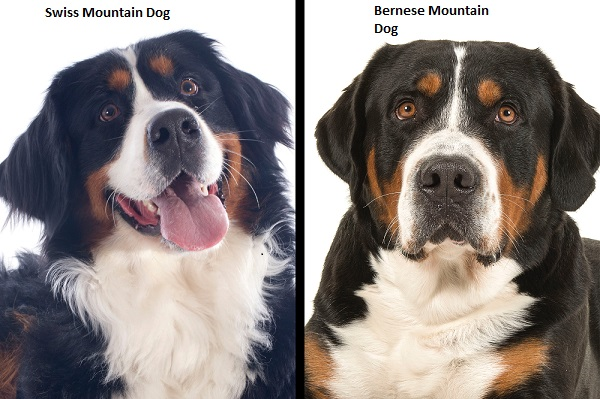

# Stanford Dogs dataset classifier
by Yashaswi Yenugu

# The Dataset
The Stanford Dogs dataset has images of 120 dog breeds from around the world.

The contents of the dataset are:
- ***Number of Categories*** = 120
- ***Total Number of images*** = 20,580

The number of images per dog breed is low to train a neural network from scratch.
Hence it would be beneficial to use transfer learning. 
The dataset is imported from Kaggle.
The data can be found at https://www.kaggle.com/jessicali9530/stanford-dogs-dataset

More information about the dataset can be found at http://vision.stanford.edu/aditya86/ImageNetDogs/

# Inception V3
InceptionV3 is a convolutional neural network for assisting in image analysis and object detection, and got its start as a module for Googlenet. It is the third edition of Google's Inception Convolutional Neural Network, originally introduced during the ImageNet Recognition Challenge.
The model network uses the weights of the inception network trained on the 'imagenet' database and frozen.
The network is shown below.

# Challenges The network might face
The dataset contains dog breeds which are visually similar to each other.
This might cause challenges for the network.

As you can see Swiss mountain dogs and Bernese Mountain dogs are very similar

# Overview of the entire network

1. Input to Inceptionv3 (non trainable)
2. Average Pooling 2D layer
3. Flattening layer
4. Dropout layer 
5. Dense layer (240 units)
6. Dropout layer
7. Dense layer (240 units)
8. Dropout layer
9. Softmax layer (120 units)

The network uses data augmentation and dropout to reduce overfitting and is implemented in a google colab environment

# Training and Testing accuracy
After training with 80%-20% training and testing split respectively the results are as follows.
- ***Training accuracy*** = 78%
- ***Testing accuracy*** = 72%

***Note*** - The trained weights have been provided in the repo. Importing them has been desribed in the instructions below.

# Instructions

1. Download the code from the repository to your computer
2. Open the ***Dog_classifier.ipynb*** file from the repository in the browser.
3. After opening click on the 'Open in Colab' button. This will redirect you to a google colab environment.
4. Download the files named ***'checkpoint', 'cp.ckpt.data-00000-of-00001', 'cp.ckpt.index' and 'kaggle.json'***.
5. Run the code cells of the notebook.
6. Ignore the code cells under headings labeled ***(*skip)*** if you only want to test the network without training.
7. Upload the files ***'checkpoint', 'cp.ckpt.data-00000-of-00001' and 'cp.ckpt.index'*** when asked by the notebook. This will import the weights.
8. Run the subsequent cells to upload your own images to test the network. Further instructions are given in the notebook

